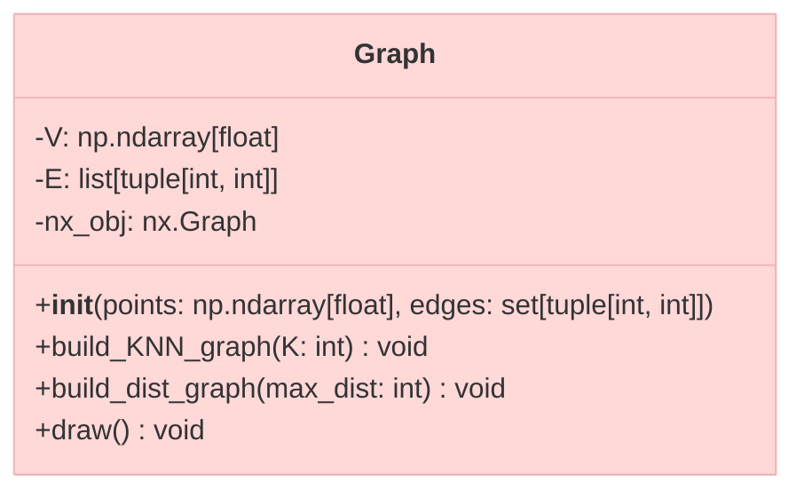

# Ветка `graphs_implementation`

**Описание**: Реализация графовых структур, алгоритмов анализа и визуализации характеристик.

## Основная функциональность

- **Представление графа** в виде классов (хранение структуры, атрибутов, методов построения)
- **Вычисление характеристик** (максимальная/минимальная степень, кликовое число и др.)
- **Визуализация статистик** (гистограммы, распределения характеристик при варьировании параметров)
- **Построение критической области** и оценки ошибок первого рода/мощностей

## Структура кода

```text
/src
  /graph.py                         # Основной класс графа
  /graph_characteristic.py          # Вычисление характеристик
  /graph_characteristic_test.py     # Тесты для вычисления характеристик
  /graph_simulate_statistics.py     # отрисовка графиков и статистик
  /graph_implementation.ipynb       # Весь код в красивом Jupiter ноутбуке с комментариями
```

## UML-диаграмма класса Graph


